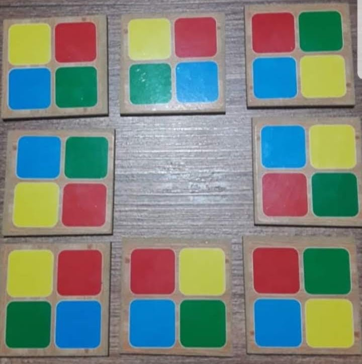

Puzzle game 8x4 Colors
------------------

This puzzle have 8 pieces each one with four colors (Yellow, Blue, Green and Red).

You need to put all pieces together form a square like a 3x3 pices but without a piece on the middle, see image below.



I found two possibles solutions for this puzzle using this code, the new challange now is make get solution using Machine Learn, for this I will use Brain.js

This was the solution found using normal code:
```
[Y B][B Y][Y R]
[G R][R G][G B]
[G R]     [G B]
[B Y]     [R Y]
[G B][B G][G Y]
[Y R][R Y][R B]
----------------
[G Y][Y G][G B]
[R B][B R][R Y]
[R B]     [R Y]
[Y G]     [B G]
[R B][G Y][G R]
[Y G][R B][B Y]
----------------
```
